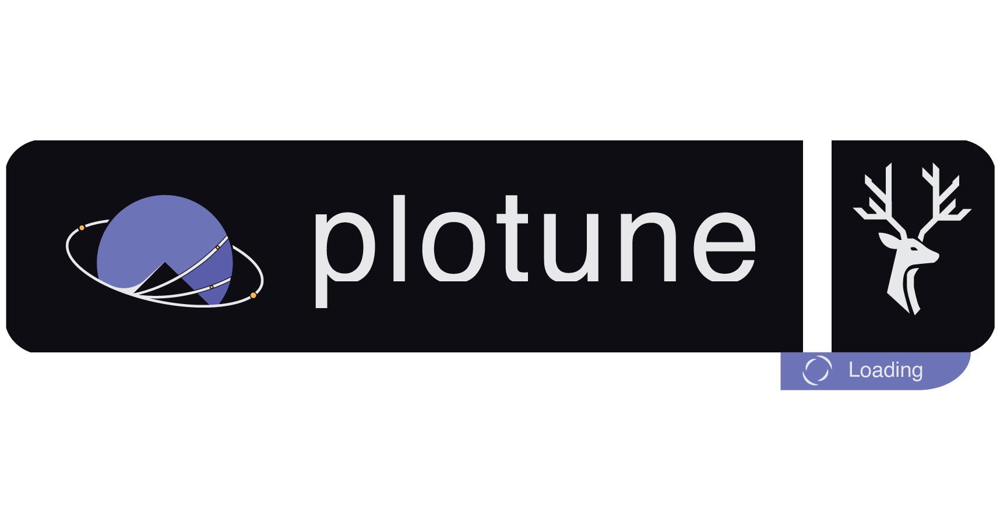

  

Plotune is a **micro-kernel data flow visualization, analysis, and streaming platform** built with **Qt5** and **FastAPI**.
It provides a **modular, extensible environment** for working with diverse data types — especially **time-series data**.

# Plotune Download Center
Download the latest version of Plotune for Windows, macOS, and Linux.

[View Releases →](https://github.com/baksi-org/plotune-dl/releases)

## 🚀 Features

### Workspace & UI

* **Multi-Layer Canvas** — Organize your workspace with multiple layers and tabs
* **Modern Interface** — Clean, drag-and-drop UI with professional look

### Visualization & Analysis

* **Rich Component Library**:

  * Oscilloscope for time-series data visualization
  * Scatter plots for correlation analysis
  * Statistical panels for quick insights
  * Video player for multimedia analysis
  * Data recorder for capturing and saving signals
  * Bridge component for integrating extensions

### Extensibility & Integration

* **Extension System** — Plugin architecture for additional functionality
* **Real-Time Data Processing** — Stream and analyze data live
* **API Gateway** — FastAPI backend for integrations and remote control

---

## 📘 API Documentation

Access the API once the server is running:

* [Swagger UI](http://127.0.0.1:8000/docs)
* [ReDoc](http://127.0.0.1:8000/redoc)
* [Online Docs](https://www.plotune.net/#/docs)

---

## ⚖️ License

This project is **proprietary software**.
For licensing details, please contact the development team.

---

<em>Plotune — Empowering Data Analysis and Visualization</em>

